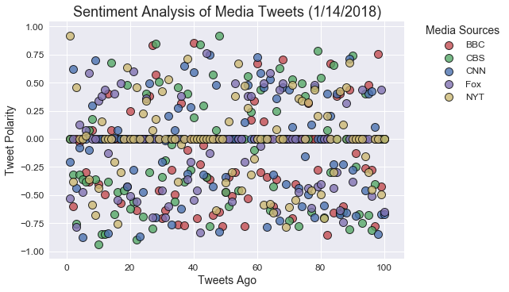

# Unit 7 | Assignment - Distinguishing Sentiments

### Analysis
- On average, the BBC had the most negative sentiment while the New York times, while still negative, was the least out of all the media outlets.
- A majority of tweets seem to be neutral, while the averages are skewed by a relatively small number of very negative and very positive tweets.
- Average tweet polarity between the different media outlets averages a .1 difference between the lowest and highest tweet polarity scores. This means that most of the media outlets had pretty similar underlying negative sentiment while tweeting.


```python
# Dependencies
import tweepy
import json
import pandas as pd
import numpy as np
import matplotlib.pyplot as plt
import seaborn as sns
```

## Pull all tweet data


```python
# Import and Initialize Sentiment Analyzer
from vaderSentiment.vaderSentiment import SentimentIntensityAnalyzer
analyzer = SentimentIntensityAnalyzer()

# Twitter API Keys
consumerKey = 'LqyVgiQR623hgzkiFniUVtPbp'
consumerSecret = '8zmujVSE8X9TgHHeB68np9XPJ0uGnIaIElE9BUGwOpkINArAE9'
accessToken = '148433925-MO7mx9x62sGpuk39xY0GU5XCZVk46YKWjXh3l2CT'
accessTokenSecret = 'QQtag1M9uVrc5w350TNb3sWVx9uDPh0WHhhMK70tQzxGh'

# Setup Tweepy API Authentication
auth = tweepy.OAuthHandler(consumerKey,consumerSecret)
auth.set_access_token(accessToken,accessTokenSecret)
api = tweepy.API(auth)

# Target User Account (using dictionary)
targetUsers = {'@BBCNews' : 'BBC',
               '@CBSNews': 'CBS',
               '@CNN' : 'CNN',
               '@FoxNews' : 'Fox',
               '@nytimes' : 'NYT'}

# Final Dictionary
dataDict = {}
dKeys = ['Twitter Account','Number of Tweets Ago','Date','Tweet','Compound Score','Positive Score','Neutral Score','Negative Score'] #dictionary keys

# Number of tweets to pull
n = 100

# Variables for holding returned data
userName = []
tweetsAgoList = []
dateList = []
textList = []
compoundList = []
positiveList = []
negativeList = []
neutralList = []
# List of all variables
dataHolder = [userName,tweetsAgoList,dateList,textList,compoundList,positiveList,negativeList,neutralList]

# Cycle through all users and get tweet data
for twitterhandle,outletName in targetUsers.items():
    c = 1 #set counter

    # Iterate through all status's using Tweepy Cursor
    for page in tweepy.Cursor(api.user_timeline, id=twitterhandle).pages(n):

        # Make page into JSON to grab data
        page = page[0]
        tweet = json.dumps(page._json, indent=3)
        tweet = json.loads(tweet)

        # Save values
        tweetsAgo = c
        date = tweet['created_at']
        text = tweet['text']

        # Run Vader Analysis on each tweet and save values
        comp = analyzer.polarity_scores(text)["compound"]
        pos = analyzer.polarity_scores(text)["pos"]
        neu = analyzer.polarity_scores(text)["neu"]
        neg = analyzer.polarity_scores(text)["neg"]

        allVariables = [outletName,tweetsAgo,date,text,comp,pos,neu,neg]

        for h, v in zip(dataHolder, allVariables):
            h.append(v)

        c += 1

# Create dictionary of values for DataFrame
for h, k in zip(dataHolder, dKeys):
    dataDict[k] = h
```

## Create DataFrame with Twitter Data


```python
# Create DataFrame
tweetDataDF = pd.DataFrame(dataDict)
tweetDataDF = tweetDataDF[dKeys]

# Export data
tweetDataDF.to_csv('output/tweetData.csv')

tweetDataDF.head()
```


<div>
<style>
    .dataframe thead tr:only-child th {
        text-align: right;
    }

    .dataframe thead th {
        text-align: left;
    }

    .dataframe tbody tr th {
        vertical-align: top;
    }
</style>
<table border="1" class="dataframe">
  <thead>
    <tr style="text-align: right;">
      <th></th>
      <th>Twitter Account</th>
      <th>Number of Tweets Ago</th>
      <th>Date</th>
      <th>Tweet</th>
      <th>Compound Score</th>
      <th>Positive Score</th>
      <th>Neutral Score</th>
      <th>Negative Score</th>
    </tr>
  </thead>
  <tbody>
    <tr>
      <th>0</th>
      <td>BBC</td>
      <td>1</td>
      <td>Mon Jan 15 07:02:40 +0000 2018</td>
      <td>Carillion to go into liquidation https://t.co/...</td>
      <td>0.0000</td>
      <td>0.000</td>
      <td>1.000</td>
      <td>0.000</td>
    </tr>
    <tr>
      <th>1</th>
      <td>BBC</td>
      <td>2</td>
      <td>Sun Jan 14 13:00:52 +0000 2018</td>
      <td>Cassie Hayes death: Tribute to Tui Southport t...</td>
      <td>-0.5994</td>
      <td>0.000</td>
      <td>0.698</td>
      <td>0.302</td>
    </tr>
    <tr>
      <th>2</th>
      <td>BBC</td>
      <td>3</td>
      <td>Sun Jan 14 03:00:30 +0000 2018</td>
      <td>Sturgeon: UK Brexit plan 'beggars belief' http...</td>
      <td>0.0000</td>
      <td>0.000</td>
      <td>1.000</td>
      <td>0.000</td>
    </tr>
    <tr>
      <th>3</th>
      <td>BBC</td>
      <td>4</td>
      <td>Sat Jan 13 01:26:11 +0000 2018</td>
      <td>Nottingham railway station to reopen after hug...</td>
      <td>-0.0258</td>
      <td>0.197</td>
      <td>0.598</td>
      <td>0.205</td>
    </tr>
    <tr>
      <th>4</th>
      <td>BBC</td>
      <td>5</td>
      <td>Fri Jan 12 19:30:34 +0000 2018</td>
      <td>RT @BBCSport: Ryan Giggs and Craig Bellamy hav...</td>
      <td>0.0000</td>
      <td>0.000</td>
      <td>1.000</td>
      <td>0.000</td>
    </tr>
  </tbody>
</table>
</div>


## Sentiment Analysis per Media Status


```python
# Slice Tweet DF for individual news outlets
compDF = tweetDataDF[['Twitter Account','Number of Tweets Ago','Compound Score']]

autoList = [] #list placeholder

# Create list of DFs for each media outlet
for k,v in targetUsers.items():
    x = compDF['Twitter Account'] == v
    z = compDF[x]
    z = z.rename(columns={'Compound Score':v})
    z = z.drop(['Twitter Account'], axis=1)
    autoList.append(z)

# Merge new Dataframes
l = len(autoList)
n = 0
mergedCompDF = autoList[0]
while n < l-1:
    mergedCompDF = pd.merge(mergedCompDF,autoList[n+1],on='Number of Tweets Ago')
    n += 1

mergedCompDF.head()
```


<div>
<style>
    .dataframe thead tr:only-child th {
        text-align: right;
    }

    .dataframe thead th {
        text-align: left;
    }

    .dataframe tbody tr th {
        vertical-align: top;
    }
</style>
<table border="1" class="dataframe">
  <thead>
    <tr style="text-align: right;">
      <th></th>
      <th>Number of Tweets Ago</th>
      <th>BBC</th>
      <th>CBS</th>
      <th>CNN</th>
      <th>Fox</th>
      <th>NYT</th>
    </tr>
  </thead>
  <tbody>
    <tr>
      <th>0</th>
      <td>1</td>
      <td>0.0000</td>
      <td>0.0000</td>
      <td>-0.2023</td>
      <td>-0.5267</td>
      <td>0.9147</td>
    </tr>
    <tr>
      <th>1</th>
      <td>2</td>
      <td>-0.5994</td>
      <td>-0.3182</td>
      <td>0.6209</td>
      <td>0.0000</td>
      <td>-0.3818</td>
    </tr>
    <tr>
      <th>2</th>
      <td>3</td>
      <td>0.0000</td>
      <td>-0.7579</td>
      <td>-0.4404</td>
      <td>-0.7845</td>
      <td>0.4588</td>
    </tr>
    <tr>
      <th>3</th>
      <td>4</td>
      <td>-0.0258</td>
      <td>-0.3182</td>
      <td>-0.0772</td>
      <td>0.1280</td>
      <td>0.0000</td>
    </tr>
    <tr>
      <th>4</th>
      <td>5</td>
      <td>0.0000</td>
      <td>-0.3612</td>
      <td>-0.8735</td>
      <td>-0.4767</td>
      <td>0.0000</td>
    </tr>
  </tbody>
</table>
</div>


```python
# Import modules
import datetime

# Set up propper date
now = datetime.datetime.now()
date = '({}/{}/{})'.format(now.month, now.day, now.year) #add date to title

# Set color scheme
deep=["#C44E52", "#55A868", "#4C72B0", "#8172B2", "#CCB974", "#64B5CD"]

# Create plot with all news outlets
axBBC = mergedCompDF.plot(kind='scatter', x='Number of Tweets Ago', y='BBC', color=deep[0], label='BBC', s=100, linewidths = 1, edgecolors = 'k', alpha=0.8)    
axCBS = mergedCompDF.plot(kind='scatter', x='Number of Tweets Ago', y='CBS', color=deep[1], ax=axBBC, label='CBS', s=100, linewidths = 1, edgecolors = 'k', alpha=0.8)    
axCNN = mergedCompDF.plot(kind='scatter', x='Number of Tweets Ago', y='CNN', color=deep[2], ax=axBBC, label='CNN', s=100, linewidths = 1, edgecolors = 'k', alpha=0.8)    
axFOX = mergedCompDF.plot(kind='scatter', x='Number of Tweets Ago', y='Fox', color=deep[3], ax=axBBC, label='Fox', s=100, linewidths = 1, edgecolors = 'k', alpha=0.8)    
axNYT = mergedCompDF.plot(kind='scatter', x='Number of Tweets Ago', y='NYT', color=deep[4], ax=axBBC, label='NYT', s=100, linewidths = 1, edgecolors = 'k', alpha=0.8)    

plt.title('Sentiment Analysis of Media Tweets {}'.format(date),fontsize=18) #Create graph title
plt.xlabel('Tweets Ago', fontsize=14) #Create x-axis label
plt.ylabel('Tweet Polarity', fontsize=14) #Create y-axis label
plt.tick_params(axis='both', labelsize=12) #Format Axis
legend = plt.legend(bbox_to_anchor=(1.05, 1), loc=2, borderaxespad=0., title='Media Sources', fontsize=12)
legend.get_title().set_fontsize('14') #Set legend title font size

plt.savefig('output/scatterplot.png') #save plot
plt.show() #show plot
```





## Overall Media Sentiment


```python
# Create groupby Twitter Account DataFrame to plot
mediaOutletGB = tweetDataDF.groupby('Twitter Account')
compoundSum = mediaOutletGB['Compound Score'].mean() #get mean of compound score
mediaOutletDF = pd.DataFrame({'Mean Compound Score' : compoundSum}) #create DF

ax = mediaOutletDF.plot.bar(subplots=True,
                            legend=False,
                            width=1,
                            color=deep,
                            linewidth = 1,
                            edgecolor = 'k')

plt.title('Sentiment Analysis of Media Tweets {}'.format(date),fontsize=18) #Create graph title
plt.xlabel('Media Accounts', fontsize=14) #Create x-axis label
plt.ylabel('Tweet Polarity', fontsize=14) #Create y-axis label
plt.tick_params(axis='both', labelsize=12) #Format Axis


plt.savefig('output/barplot.png')
plt.show()
```


```python

```
